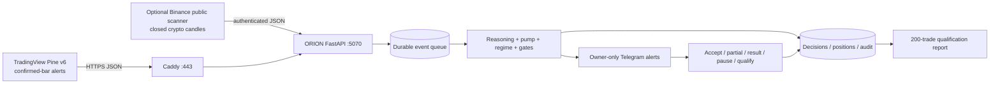

# ORION Extreme v3.1

Production-candidate **paper/signal trading intelligence** for phone-first operation through Telegram, TradingView confirmed-bar alerts, and an optional free public crypto scanner.

## Operating boundary

ORION does not log into a broker, click broker buttons, place orders, withdraw funds, or claim profitability. It records and qualifies paper/manual decisions. Pocket Option mode is a signal and tracking workflow only. OTC entries are blocked unless a fresh matching broker feed is explicitly supplied.

## What is included

- Weighted seven-advisor reasoning council with explicit explanations and skeptic vetoes.
- Expanded pump stages: quiet accumulation, pressure building, breakout confirmation, early pump, full pump, distribution, and dump risk.
- Exit management: hard stop, 1.618R secure-75% target, 2.618R runner target, trailing protection, liquidity-pull/whale-dump exits.
- Pocket, TradingView, paper, and automatic mode selection.
- Owner-only Telegram listening agent and push alerts.
- TradingView Pine v6 confirmed-bar bridge.
- Fast authenticated webhooks with immediate `202` queue acknowledgement.
- Durable SQLite queue, decisions, acceptances, positions, broker-confirmed outcomes, learning samples, settings, and audit log.
- Optional Binance public-data scanner for non-OTC crypto. No API key is required.
- Qualification report with payout-adjusted break-even, Wilson 95% lower bound, expectancy, drawdown, loss streak, and concentration checks.
- Operator pause, high-impact-news blackout flag, stale-signal gate, cooldown, hourly cap, maximum open positions, daily-loss stop, and 2% maximum modeled risk.
- Consistent SQLite backups and hardened systemd units.

## Architecture



A static version is included at [`architecture/orion_architecture.svg`](architecture/orion_architecture.svg).

## Local verification

```bash
python3 -m venv .venv
. .venv/bin/activate
pip install -r requirements-dev.txt
bash scripts/verify.sh
```

The test suite does not require broker credentials or a live trading account.

## Local demonstration

```bash
python orion_production.py --demo
```

## Configuration

```bash
python scripts/generate_env.py
# Then edit .env and enter Telegram values.
set -a; . ./.env; set +a
python orion_production.py --doctor
```

Required for the service:

- `ORION_WEBHOOK_TOKEN`: separate random secret, at least 24 characters.
- `ORION_API_TOKEN`: different random secret, at least 24 characters.

Required for Telegram:

- `TELEGRAM_BOT_TOKEN`
- `TELEGRAM_CHAT_ID`
- `TELEGRAM_OWNER_USER_ID`

The owner user ID is checked on every command. Unauthorized command text is not stored; only a hash is written to the audit log.

## Run the service

```bash
set -a; . ./.env; set +a
python orion_production.py --serve --host 127.0.0.1 --port 5070
```

Public service exposure should go through Caddy over HTTPS. Do not bind ORION directly to the public network.

## Telegram commands

```text
/status
/last [SYMBOL]
/reason [SYMBOL]
/analyze SYMBOL
/pump
/positions
/accept DECISION_ID ENTRY [RISK_OR_STAKE] [PAYOUT%]
/partial POSITION_ID PRICE
/result POSITION_ID win|loss|push [PAYOUT%] [PNL]
/qualify
/queue
/pause REASON
/resume
/capital AMOUNT
/payout PERCENT
/arm
/disarm
/mode auto|pocket|tradingview|paper
/reset_risk I_UNDERSTAND
```

`/accept` captures a fresh manual/broker entry and checks age, slippage, actual payout, and the 2% risk cap. It opens a paper/manual tracking record; it does not place an order.

## TradingView setup

1. Open `tradingview/orion_extreme_v3_bridge.pine` in Pine Editor.
2. Add it to a chart and configure mode, current payout, higher timeframe, and OTC fields.
3. Create an alert using **Any alert() function call** and **Once Per Bar Close**.
4. Use this webhook shape:

```text
https://orion.dominionhealing.org/webhook/tradingview/<ORION_WEBHOOK_TOKEN>
```

5. Keep `High-impact news blackout` enabled during scheduled events when you do not want new entries.

The bridge sends confirmed-bar JSON. ORION independently recalculates the decision and enforces all server-side gates.

## Optional free public crypto scanner

The scanner reads closed candles and top-of-book prices from Binance's public market-data endpoint. It has no account or order permissions.

Inspect without posting:

```bash
set -a; . ./.env; set +a
python orion_market_scanner.py --symbols BTCUSDT,ETHUSDT --intervals 1m,5m --print-only
```

Run one scan and send it to ORION:

```bash
python orion_market_scanner.py --symbols BTCUSDT,ETHUSDT --intervals 1m,5m
```

Run continuously:

```bash
python orion_market_scanner.py --watch
```

The scanner is not a Pocket Option quote feed and never supports OTC. External exchange quotes may differ from broker quotes.

## Foundation VM deployment

```bash
sudo bash scripts/install.sh
sudoedit /opt/orion-extreme/.env
sudo systemctl restart orion-extreme-v3
sudo systemctl status orion-extreme-v3 --no-pager
```

Then add `deployment/Caddyfile.snippet` to Caddy, validate, and reload:

```bash
sudo caddy validate --config /etc/caddy/Caddyfile
sudo systemctl reload caddy
```

The optional scanner is deliberately disabled by the installer:

```bash
sudo systemctl enable --now orion-extreme-v3-scanner
```

Daily backups are enabled through `orion-extreme-v3-backup.timer` and retained for 30 days.

## Private API

Use `Authorization: Bearer <ORION_API_TOKEN>`.

- `GET /health` — public health, database integrity, queue, pause state.
- `GET /api/v1/status`
- `GET /api/v1/latest`
- `GET /api/v1/qualification`
- `GET /api/v1/positions`
- `GET /api/v1/audit?limit=100`
- `POST /api/v1/backup`

## Qualification before real funds

The software remains paper/manual regardless of the report. The minimum standard requires.

- At least 200 broker-confirmed demo outcomes.
- Wilson 95% lower confidence bound above payout-adjusted break-even.
- Positive realized expectancy using actual payout and stake data.
- Drawdown and loss streak within policy.
- No symbol, timeframe, or regime above 35% concentration.

See `QUALIFICATION_STANDARD.md`.

## Known production gates still requiring your accounts

The package can be used for paper/demo operation now. These external steps cannot be completed offline:

- Compile the Pine script inside your TradingView account.
- Send a real TradingView alert through the public HTTPS endpoint.
- Verify the Telegram token, destination chat ID, and owner user ID.
- Compare signal timestamps and prices against your actual broker screen.
- Complete at least 200 broker-confirmed demo trades before considering real funds.

## Security rules

- Never put broker passwords, session cookies, API secrets, or withdrawal credentials in TradingView payloads.
- Keep `.env` mode `0600` and owned by the service account.
- Use separate webhook and API tokens.
- Leave automated broker execution disabled.
- Back up the SQLite database before upgrades.
- Review `audit_log` after any unexpected alert or command.
